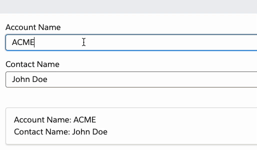

# LWC Signals

A simple yet powerful reactive state management solution for Lightning Web Components.

---

Inspired by the Signals technology behind SolidJs, Preact, Svelte 5 Runes and the Vue 3 Composition API, LWC Signals is a
reactive signals for Lightning Web Components that allows you to create reactive data signalss
that can be used to share state between components.

It features:

- 🚀 **Reactivity** Based on SolidJs and Preact Signals it provides a fine-grained reactivity system that will automatically track dependencies and free them when not needed
- 🦥 **Lazy Evaluation** Signals are lazy and will only compute values when read.
- 🔬️ **Small Surface** The API does not offer more than what is needed, keeping the learning curve and bloat to a minimum

# Getting Started

Copy the `force-app/lwc/signals` folder to your project.

> ✏️ Note that the source code is written in Typescript and is located in the `src` folder. The `force-app/lwc/signals`
> folder
> contains the compiled code. If you wish to modify the source code you can either modify the resulting JS code, or you
> can
> grab the Typescript files from the `src` folder and set up your project to compile them.

# Usage

## Introduction

The LWC framework relies on message passing (either through pub/sub, CustomEvents or the Lightning Message Service (
LMS))
to communicate between components.

This can be cumbersome when you have a lot of components that need to share state for many reasons:

- You have to dispatch and handle the state events through all the components in the hierarchy (when using CustomEvents)
- You have to manage the state in a parent component, which relies on having the component on the page (when using
  pub/sub and messages)
- You have to make sure manage subscriptions and unsubscriptions to events

An alternative is to use the `wire` service to get the data from the server and let the framework handle the caching
for you, but this only works for data that is signalsd in the server, and still forces you to implement a lot of
boilerplate code to manage each wire adapter for each component.

`LWC Signals` provides a simple way to create reactive data signalss that can be used to share state between components
without the need to broadcast messages or manage subscriptions and wires.

## Creating a signals

> 👀 You can find the full working code for the following example in the `examples`
> folder.

A `signals` is simply an object with a `.value` property which holds a value. Any signals you create should be an LWC
Service that exports your signals.

```javascript
// LWC Service: counter-signals.js
import { $signals } from "c/signals";

const counter = $signals(0);

export { counter };
```

## Consuming the signals

You can use the signals in any LWC component by importing the signals and using the `.value` property.

For example, let's create a simple counter component that increments and decrements the counter when a button is
clicked.

```html
<!-- counter.html -->
<template>
  <div>
    <button onclick="{decrement}">Decrement</button>
    <button onclick="{increment}">Increment</button>
  </div>
</template>
```

To update the counter, you can simply change the `counter.value` property directly.

```javascript
// counter.js
import { LightningElement } from "lwc";
import { counter } from "c/counter-signals";

export default class Counter extends LightningElement {
  increment() {
    counter.value++;
  }

  decrement() {
    counter.value--;
  }
}
```

## Reacting to changes

### `$reactTo`

To have your components automatically react to changes in the signals, you can use the `$reactTo`
function to create a reactive value that will update whenever the signals changes.

Let's create another component that displays the counter value and automatically updates when the counter changes.

```html
<!-- display.html -->
<template>
  <p>The current count is: {counter.value}</p>
</template>
```

```javascript
// display.js
import { LightningElement } from "lwc";
import { $reactTo } from "c/signals";
import { counter } from "c/counter-signals";

export default class Display extends LightningElement {
  get counter() {
    return $reactTo(counter);
  }
}
```

> ❗`$reactTo` should be used inside a getter to make sure that the UI updates when the value changes.
> Keep reading to see other ways to react to changes in the signals.

<div style="text-align: center;">
    
</div>

---

### `$computed`

You can also use the `$computed` function to create a reactive value that depends on the signals.
The difference between `$reactTo` and `$computed` is that `$computed` allows you return a derived computed signals (with
the difference of it being read only)
from the original, or multiple signals.

```javascript
// display.js
import { LightningElement } from "lwc";
import { $computed } from "c/signals";
import { counter } from "c/counter-signals";

export default class Display extends LightningElement {
  get counterMultiplied() {
    return $computed(() => counter.value * 2).value;
  }
}
```

---

Notice that in the examples we have been using getters to react to value changes. This is because LWC's reactive system
can automatically detect changes in getters for simple values and updates the UI accordingly, which makes for a cleaner
developer experience
and easier to reason about the code.

But there are cases where we need to use a property in case of a getter, for example when computing values into a
complex object, in which case the LWC
framework won't update the UI automatically. For cases like this, you can leverage the
`$computed` function to create a reactive property that will update whenever the signals changes.

> See the (Reacting to multiple signals)[#reacting-to-multiple-signals] section for an example where we need
> to use a property instead of a getter.

```javascript
// display.js
import { LightningElement } from "lwc";
import { $computed } from "c/signals";
import { counter } from "c/counter-signals";

export default class Display extends LightningElement {
  counter = $computed(counter, () => (this.counter = counter.value)).value;
}
```

> ❗ Note that in the callback function we **need** to reassign the value to `this.counter`
> to trigger the reactivity. This is because we need the value to be reassigned so that
> LWC reactive system can detect the change and update the UI.

### Stacking computed values

You can also stack computed values to create more complex reactive values that derive from each other

```javascript
import { $signals, $computed } from "c/signals";

export const counter = $signals(0);

export const counterPlusOne = $computed(() => counter.value + 1);
export const counterPlusTwo = $computed(() => counterPlusOne.value + 1);
```

Because `$computed` values return a signals, you can use them as you would use any other signals.

## Reacting to multiple signals

You can also use multiple signals in a single `computed` and react to changes in any of them.
This gives you the ability to create complex reactive values that depend on multiple data sources
without having to track each one independently.

> 👀 You can find the full working code for the following example in the `examples`
> folder.

**Given the following signals**

```javascript
// LWC Service: contact-info.js

import { $signals } from "c/signals";

export const accountName = $signals("ACME");

export const contactName = $signals("John Doe");
```

**And given a component that updates both signals**

```html
<!-- contactInfoForm.html -->
<template>
  <lightning-input
    label="Account Name"
    value="{accountName}"
    onchange="{handleAccountNameChange}"
  ></lightning-input>
  <lightning-input
    label="Contact Name"
    value="{contactName}"
    onchange="{handleContactNameChange}"
  ></lightning-input>
</template>
```

```javascript
// contactInfoForm.js
import { LightningElement } from "lwc";
import { $reactTo } from "c/signals";
import { accountName, contactName } from "c/demoSignalss";

export default class ContactInfoForm extends LightningElement {
  get accountName() {
    return $reactTo(accountName);
  }

  get contactName() {
    return $reactTo(contactName);
  }

  handleAccountNameChange(event) {
    accountName.value = event.target.value;
  }

  handleContactNameChange(event) {
    contactName.value = event.target.value;
  }
}
```

**You can create a computed value that depends on both signalss**

```html
<!-- businessCard.html -->
<template>
  <div class="slds-card">
    <div class="slds-card__body slds-card__body_inner">
      <div>Account Name: {contactInfo.accountName}</div>
      <div>Contact Name: {contactInfo.contactName}</div>
    </div>
  </div>
</template>
```

```javascript
// businessCard.js
import { LightningElement } from "lwc";
import { $computed } from "c/signals";
import { accountName, contactName } from "c/demoSignalss";

export default class BusinessCard extends LightningElement {
  contactInfo = $computed(
    () =>
      (this.contactInfo = {
        accountName: accountName.value,
        contactName: contactName.value
      })
  ).value;
}
```

<div style="text-align: center;">
    
</div>

> ❗ Notice that we are using a property instead of a getter in the `$computed` callback function, because
> we need to reassign the value to `this.contactInfo` to trigger the reactivity, as it is a complex object.

### `$effect`

You can also use the `$effect` function to create a side effect that depends on the signals.

Let's say you want to keep a log of the changes in the `counter` signals.

```javascript
import { $signals, $effect } from "c/signals";

export const counter = $signals(0);

$effect(() => console.log(counter.value));
```

> ❗ DO NOT use `$effect` to update the signals value, as it will create an infinite loop.

## Communicating with Apex data and other asynchronous operations

You can also use the signals framework to communicate with Apex data and other asynchronous operations.

In a traditional LWC component, you would use the `@wire` service to fetch data from the server and update the UI,
or you could declaratively call Apex methods by importing them and calling them directly.

If you only wish to fetch data once and hold that data within a component, you should still use the `@wire` service
or imperative Apex calls within your own component.

Where the Signals framework comes in handy is when you wish for multiple components to share the same data to have a
single
source of truth, and/or when you want to have a reactive system that updates the UI automatically when the data changes,
no matter where the change comes from.

### $resource

The `$resource` function is a helper function that allows you to create a signals that fetches data asynchronously,
which includes Apex methods imported through `@salesforce/apex/`.

---

Let's first take a look at the simple example of fetching data from the server through a single source of truth
(the resource signals) and sharing it between components.

**Given the following Apex method**

```apex
// Apex Class: ContactController.cls
public with sharing class ContactController {
    @AuraEnabled(cacheable=true)
    public static List<Contact> getContacts() {
        return [SELECT Id, Name FROM Contact];
    }
}
```

**And the following signals**

```javascript
// LWC Service: contact-signals.js
import { $resource } from "c/signals";
import getContacts from "@salesforce/apex/ContactController.getContacts";

// Notice that we have to destructure the data property from the resource signals
// We explain why below in the "refetching" section :)
export const { data: fetchContacts } = $resource(getContacts);
```

**You can use the signals in any component**

```html
<!-- contactList.html -->
<template>
  <template if:true="{contacts.loading}"> Loading</template>
  <template if:false="{contacts.loading}">
    <template for:each="{contacts.data}" for:item="contact">
      <div key="{contact.Id}">
        <p>{contact.Name}</p>
      </div>
    </template>
  </template>
</template>
```

```javascript
// contactList.js
import { LightningElement } from "lwc";
import { $computed } from "c/signals";
import { fetchContacts } from "c/contact-signals";

export default class ContactList extends LightningElement {
  contacts = $computed(() => (this.contacts = fetchContacts.value)).value;
}
```

Data from a resource signals comes in the following format:

```typescript
type AsyncData<T> = {
  data: T | null; // The data fetched from the server. It is null until the data is fetched
  loading: boolean; // A boolean that indicates if the data is being fetched
  error: unknown | null; // An error object that is populated if the fetch fails
};
```

> 🍪 One benefit of using the `$resource` over declarative Apex or `@wire` is that it keeps track of the loading
> state for you, which saves you the effort of having to calculate it yourself.

<div style="text-align: center;">
    
</div>

---

Let's now take a look at the more complex example of fetching data from the server through a method that takes
parameters, and having it react once those parameters change.

Imagine we have 2 components, one that displays a list of accounts and another that displays the details of a single
selected account. We want the details component to update whenever the selected account changes. Let's see how we can
achieve this with.

**Given the following Apex controller**

```apex
public with sharing class ResourceController {
    @AuraEnabled(Cacheable=true)
    public static List<Account> getAccounts() {
        return [SELECT Id, Name FROM Account];
    }

    @AuraEnabled
    public static Account getAccountDetails(Id accountId) {
        if (accountId == null) {
            return null;
        }
        return [SELECT Id, Name, Phone, Website FROM Account WHERE Id = :accountId];
    }
}
```

We can have a signals that keeps track of which Account Id has been selected, and a `resource` signals that fetches the
details of the selected account.

```javascript
import { $signals, $resource, $effect } from "c/signals";
import getAccountDetails from "@salesforce/apex/ResourceController.getAccountDetails";

export const selectedAccountId = $signals(null);

export const { data: getAccount } = $resource(getAccountDetails, () => ({
  accountId: selectedAccountId.value
}));
```

Notice that the resource signals takes a second optional argument, which in this case is a function that returns an
object with the parameters that the Apex method needs. Because this function is accessing a reactive
value (`selectedAccountId`),
the resource signals will automatically refetch the data whenever the `selectedAccountId` changes!

> 🍪 The value doesn't need to be a function unless you need the reactivity, it can also be a regular JS object in the
> format expected by your Apex method (e.g. `{ accountId: "001200000XyZ1QAQ" }`).

This works no matter how many reactive values you use in the function, and it will automatically refetch the data
whenever any of the reactive values change.

Let's now create our picklist component that allows the user to select an account.

```html
<!-- accountPicker.html -->
<template>
  <lightning-select
    label="Select Account"
    value="{currentAccountId}"
    options="{accounts}"
    onchange="{handleAccountChange}"
  ></lightning-select>
</template>
```

```javascript
// accountPicker.js
import { LightningElement, track, wire } from "lwc";
import getAccounts from "@salesforce/apex/ResourceController.getAccounts";
import { selectedAccountId } from "c/demoSignalss";

export default class AccountPicker extends LightningElement {
  @track accounts = [];

  @wire(getAccounts) getAccounts({ error, data }) {
    if (data) {
      this.accounts = data.map((account) => ({
        label: account.Name,
        value: account.Id
      }));

      if (this.accounts.length > 0) {
        selectedAccountId.value = this.accounts[0].value;
      }
    } else if (error) {
      console.error(error);
    }
  }

  get currentAccountId() {
    return selectedAccountId.value;
  }

  handleAccountChange(event) {
    selectedAccountId.value = event.detail.value;
  }
}
```

Notice how we are using a `@wire` service to fetch the accounts from the server and populate the picklist. This is
because in this case we don't care about sharing that data with other components, and we only need it once. Be
pragmatic about when to use signalss and when not to. Opt to use the base Salesforce services when you only need the data
in a single component.

Now, let's create the component that displays the details of the selected account.

```html
<!-- accountDetails.html -->
<template>
  <div>
    <h1>Selected Account</h1>
    <template if:true="{account.loading}">
      <lightning-spinner
        alternative-text="Loading"
        size="large"
      ></lightning-spinner>
    </template>

    <template if:false="{account.loading}">
      <template if:true="{account.data}">
        <p>Account Name: {account.data.Name}</p>
        <p>Phone: {account.data.Phone}</p>
        <p>Website: {account.data.Website}</p>
      </template>
    </template>
  </div>
</template>
```

```javascript
// accountDetails.js
import { LightningElement } from "lwc";
import { $computed } from "c/signals";
import { getAccount } from "c/demoSignalss";

export default class AccountDetails extends LightningElement {
  account = $computed(() => (this.account = getAccount.value)).value;
}
```

<div style="text-align: center;">
     
</div>

> 🍪 One extra feature of the data returned by the `$resource` function is that when it is reloading the data, the
> previous data is still available in the `data` property. This allows you to keep the old value while the new value is
> being loaded and provide for a smoother experience, to avoid flickering or loading spinners that disappear
> immediately,
> when you know the data is going to be fetched quickly.

---

### Providing a default value to an async resource

You can provide a default value to an async resource by passing it as the third argument to the `$resource` function.

```javascript
import { $resource } from "c/signals";

const { data: resource } = $resource(asyncFunction, undefined, {
  initialValue: "initial"
});
```

### Refetching data

When you use the `$resource` function, the signals will automatically refetch the data whenever the reactive values
change. This is useful when you want to refetch the data when the parameters change, but it can also be a problem when
you want to keep the data in the signals and only refetch it when you explicitly tell it to.

To solve this problem, you can use the `refetch` function that is returned by the `$resource` function.

```javascript
import { $signals, $resource } from "c/signals";
import getContacts from "@salesforce/apex/ContactController.getContacts";

export const { data: fetchContacts, refetch: refetchContacts } =
  $resource(getContacts);
```

You can then call the `refetch` function whenever you want to refetch the data.

```javascript
// contactList.js
import { LightningElement } from "lwc";
import { $computed } from "c/signals";
import { fetchContacts, refetchContacts } from "c/contact-signals";

export default class ContactList extends LightningElement {
  contacts = $computed(() => (this.contacts = fetchContacts.value)).value;

  handleRefresh() {
    refetchContacts();
  }
}
```

# Contributing

Contributions are welcome! Please read the [Contributing Guide](CONTRIBUTING.md) for more information.
